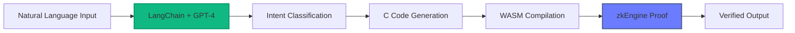

# 🚀 Novanet ZKP Agent Kit

<p align="center">
  
</p>

<p align="center">
  <strong>The First Natural Language Interface for Zero-Knowledge Proofs</strong><br>
  <em>Powered by LangChain + OpenAI GPT-4</em>
</p>

<p align="center">
  <a href="#breakthrough">The Breakthrough</a> •
  <a href="#demo">View Demo</a> •
  <a href="#how-it-works">How It Works</a> •
  <a href="#use-cases">Use Cases</a> •
  <a href="#quick-start">Quick Start</a>
</p>

<p align="center">
  
  
  
</p>

---

## 🧠 The Breakthrough: Natural Language Meets Cryptography

For the first time ever, **anyone can generate zero-knowledge proofs using plain English**. No cryptography PhD required. No complex mathematics. Just describe what you want to prove, and our AI-powered system handles the rest.

### 🌟 Why This Matters

Traditional ZKP systems require:
- ❌ Deep understanding of cryptographic protocols
- ❌ Writing complex constraint systems
- ❌ Manual circuit construction
- ❌ Weeks of development time

**Novanet ZKP Agent Kit** with LangChain + OpenAI requires:
- ✅ A simple sentence like "prove my age is over 18"
- ✅ That's it.

## 🎬 Demo

<p align="center">
  
</p>

*Watch as natural language commands instantly transform into cryptographic proofs*

## 🔮 The Power of AI-Driven ZKPs

### 1. **Democratizing Privacy Technology**

By integrating LangChain with OpenAI's GPT-4, we've made zero-knowledge proofs accessible to:
- **Developers** without cryptography backgrounds
- **Business users** who need privacy solutions
- **Researchers** exploring new applications
- **Anyone** who values privacy

### 2. **Intelligent Intent Recognition**

Our LangChain pipeline understands context and intent:

```
User: "I need to prove I'm eligible for this service"
AI: Understands this requires KYC verification → Generates age + risk score proof

User: "Verify this content came from our AI system"
AI: Recognizes authenticity need → Creates AI content proof

User: "Show I'm in San Francisco without revealing my exact location"
AI: Identifies privacy-preserving location need → Produces location boundary proof
```

### 3. **Automatic Code Generation**

The AI doesn't just understand—it creates:
1. **Interprets** natural language requests
2. **Generates** appropriate C code with correct logic
3. **Compiles** to WebAssembly automatically
4. **Produces** cryptographic proofs in seconds

## 🏗️ How It Works: The AI Pipeline



### The Magic Behind the Scenes

1. **LangChain Orchestration**
   - Structured prompts guide GPT-4 to understand ZKP requirements
   - Chain-of-thought reasoning ensures accurate code generation
   - Context-aware responses adapt to user expertise level

2. **OpenAI GPT-4 Integration**
   - Trained on vast programming knowledge
   - Understands both natural language and code semantics
   - Generates syntactically correct C code with proper constraints

3. **Automatic Transformation**
   - AI-generated C code → WebAssembly compilation
   - Smart parameter extraction from natural descriptions
   - Error handling and validation built-in

## 🎯 Revolutionary Use Cases

### 🏦 Financial Services
**Natural Language**: "Prove I meet the requirements for this loan without showing my exact income"
- AI generates income range verification
- Protects sensitive financial data
- Instant compliance checking

### 🏥 Healthcare
**Natural Language**: "Verify I'm vaccinated without revealing my medical history"
- AI creates selective disclosure proofs
- Maintains HIPAA compliance
- Enables privacy-preserving health passes

### 🎮 Gaming & Metaverse
**Natural Language**: "Prove I achieved this level without revealing my strategy"
- AI builds achievement verification systems
- Prevents cheating while preserving competitive advantage
- Enables cross-platform credential verification

### 🏢 Enterprise
**Natural Language**: "Show our AI model meets safety standards without exposing the model"
- AI constructs model property proofs
- Protects intellectual property
- Enables regulatory compliance

## ✨ Features

### 🤖 AI-Powered Natural Language Interface
- **Conversational**: Just chat with the system
- **Context-Aware**: Understands domain-specific requirements
- **Multi-lingual**: Supports queries in multiple languages (coming soon)
- **Learning**: Improves from usage patterns

### 🔧 Technical Excellence
- **LangChain Integration**: Structured AI workflows for reliable outputs
- **GPT-4 Powered**: Latest language model for code generation
- **Real-time Processing**: WebSocket updates for live progress
- **Beautiful UI**: Modern interface with inline code viewing

### 🛡️ Three Pre-Built Proof Types

1. **KYC Compliance** - "Prove I'm over 18 with low risk score"
2. **AI Authenticity** - "Verify this was created by our AI"
3. **Location Privacy** - "Confirm I'm in the city without exact coordinates"

## 🚀 Quick Start

### Prerequisites
- OpenAI API key (for GPT-4 access)
- Python 3.8+
- Rust (latest stable)
- Node.js 14+

### Installation

```bash
# Clone the repository
git clone https://github.com/hshadab/novanet-zkp-agent-kit.git
cd novanet-zkp-agent-kit

# Set up environment
cp .env.example .env
# Edit .env and add your OpenAI API key

# Install dependencies
pip install -r requirements.txt
cargo build --release

# Start the services
python langchain_service.py  # Terminal 1
cargo run                    # Terminal 2

# Open browser
open http://localhost:8001
```

## 💬 Example Conversations

### Simple Natural Language
```
You: "Prove I'm old enough to vote"
AI: ✅ Generating age verification proof...
Result: Zero-knowledge proof that age ≥ 18
```

### Complex Requirements
```
You: "I need to prove I'm a qualified investor without revealing my net worth"
AI: ✅ Creating accredited investor proof...
Result: Proof of assets > $1M OR income > $200k without revealing exact amounts
```

### Domain-Specific
```
You: "Verify this AI output came from a model with safety score above 0.95"
AI: ✅ Building AI safety verification...
Result: Proof of model_safety_score > 0.95 without exposing model architecture
```

## 🧪 The Technology Stack

### AI Layer
- **LangChain**: Orchestrates the AI pipeline, manages prompts, handles context
- **OpenAI GPT-4**: Understands intent, generates code, provides explanations
- **Custom Prompts**: Fine-tuned for ZKP generation accuracy

### ZKP Layer
- **zkEngine**: High-performance zero-knowledge proof generation
- **WebAssembly**: Universal computation format
- **Rust Backend**: Fast, safe systems programming

### Interface Layer
- **WebSocket**: Real-time bidirectional communication
- **React-inspired UI**: Responsive, modern interface
- **Inline Code Display**: Full transparency of generated proofs

## 📊 Performance Metrics

| Operation | Time | Details |
|-----------|------|---------|
| Natural Language Processing | ~1s | GPT-4 intent recognition |
| Code Generation | ~2s | C code synthesis |
| WASM Compilation | <1s | Automatic transformation |
| Proof Generation | 13-20s | Complete ZKP creation |
| Total: Natural Language → Proof | ~20s | End-to-end |

## 🔮 Future Roadmap

- **Multi-model Support**: Claude, Llama, and other LLMs
- **Proof Templates**: Save and reuse common patterns
- **Batch Processing**: Generate multiple proofs from descriptions
- **Fine-tuned Models**: Specialized models for ZKP generation
- **Natural Language Verification**: "Verify this proof means X"

## 🤝 Contributing

We're building the future of privacy technology! Contributions welcome:

- **AI Improvements**: Better prompts, new LLM integrations
- **Proof Types**: Additional real-world proof templates
- **Language Support**: Multi-language natural language processing
- **Documentation**: Tutorials, examples, use cases

See [CONTRIBUTING.md](CONTRIBUTING.md) for details.

## 📚 Research & Papers

This project builds on cutting-edge research in:
- **AI + Cryptography**: Bridging natural language and formal verification
- **LLM Code Generation**: Reliable synthesis of constraint systems
- **Zero-Knowledge Proofs**: Privacy-preserving computation

## 🙏 Acknowledgments

- **OpenAI**: For GPT-4 and the vision of accessible AI
- **LangChain**: For making LLM applications production-ready
- **zkEngine**: For the powerful proof generation backend
- **The Privacy Community**: For pushing the boundaries of what's possible

## 📄 License

MIT License - see [LICENSE](LICENSE) for details.

---

<p align="center">
  <strong>Making Privacy Technology Accessible to Everyone</strong><br>
  <em>No PhD Required</em>
</p>

<p align="center">
  <a href="https://novanet.xyz">Website</a> •
  <a href="https://docs.novanet.xyz">Documentation</a> •
  <a href="https://twitter.com/novanet_xyz">Twitter</a> •
  <a href="https://discord.gg/novanet">Discord</a>
</p>
